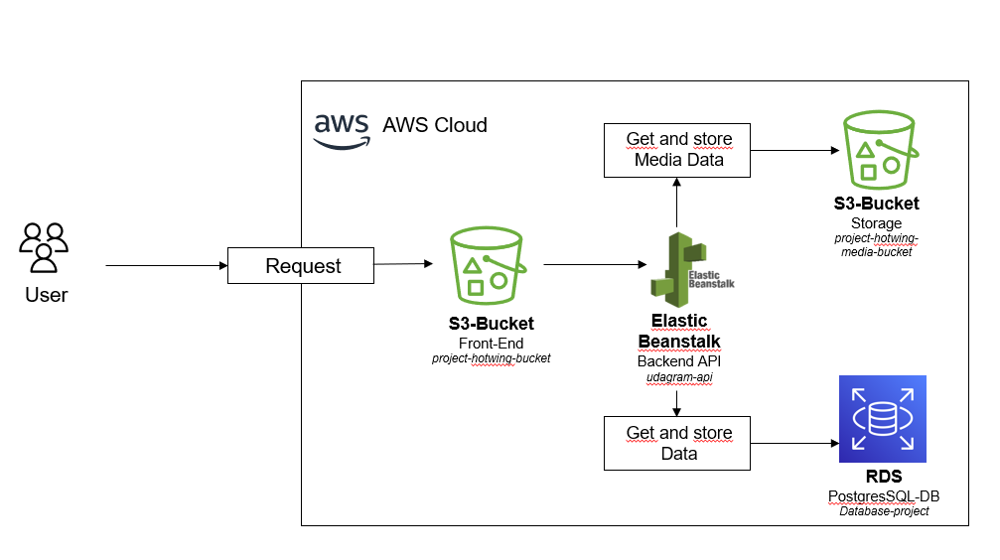

## AWS
---
### RDS Database

DB-Name: Database-project
URL: database-project.ctzkrdkhjmlp.us-east-1.rds.amazonaws.com
Port: 5432

### Elastic Beanstalk

Name: udagram-api
URL: udagram-api-dev.eba-5mpcxihk.us-east-1.elasticbeanstalk.com

### S3 Buckets

#### Front-End:

The Front-end build is hostet here. It is publicly reachable.

Name: project-hotwing-bucket
URL: http://project-hotwing-bucket.s3-website-us-east-1.amazonaws.com

### Media-Store

The Media-Store stores the media-files that are uploaded. It is connectet to the Back-End.

Name: project-hotwing-media-bucket
URL: http://project-hotwing-media-bucket.s3-website-us-east-1.amazonaws.com

